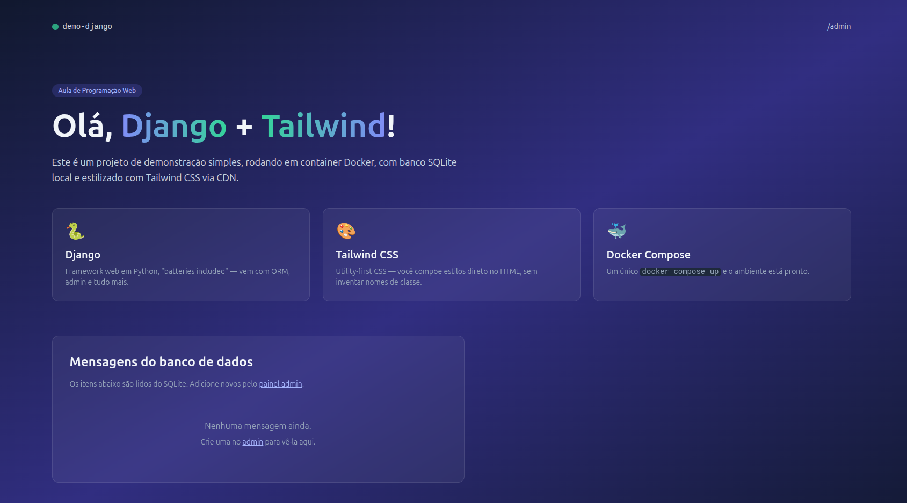

# Roteiro — Construindo um site com Django + Tailwind + Docker

## Parte II - Criando Modelos e Rotas

Este roteiro é um **passo a passo** para você construir, do zero, o projeto
`demo-django`: um site simples de uma página, escrito em **Django**, estilizado
com **Tailwind CSS** (via CDN), salvando dados em **SQLite** e executado dentro
de um container **Docker**.


---

## Sumário

1. [Pré-requisitos](#1-pré-requisitos)
2. [Criar a pasta do projeto](#2-criar-a-pasta-do-projeto)
3. [Declarar as dependências (`requirements.txt`)](#3-declarar-as-dependências-requirementstxt)
4. [Escrever o `Dockerfile`](#4-escrever-o-dockerfile)
5. [Escrever o `docker-compose.yml`](#5-escrever-o-docker-composeyml)
6. [Configurar `.gitignore` e `.dockerignore`](#6-configurar-gitignore-e-dockerignore)
7. [Gerar a estrutura do Django](#7-gerar-a-estrutura-do-django)
8. [Criar o app `home`](#8-criar-o-app-home)
9. [Ajustar `core/settings.py`](#9-ajustar-coresettingspy)
10. [Definir o modelo `Mensagem`](#10-definir-o-modelo-mensagem)
11. [Registrar o modelo no admin](#11-registrar-o-modelo-no-admin)
12. [Criar a view `index`](#12-criar-a-view-index)
13. [Configurar as URLs](#13-configurar-as-urls)
14. [Criar o template HTML com Tailwind](#14-criar-o-template-html-com-tailwind)
15. [Aplicar as migrations e subir o servidor](#15-aplicar-as-migrations-e-subir-o-servidor)

---

## 1. Pré-requisitos

Você precisa ter instalado:

- [Docker](https://docs.docker.com/get-docker/) (inclui o `docker compose`).
- Um editor de texto (VS Code, por exemplo).
- Um terminal (Bash, Zsh ou PowerShell).

> 💡 **Por que Docker?** Para você não precisar instalar Python e Django direto
> na sua máquina. Tudo roda dentro de um container isolado.

Verifique no terminal:

```bash
docker --version
docker compose version
```

---

## 2. Criar a pasta do projeto

Crie e entre na pasta:

```bash
mkdir demo-django
cd demo-django
```

A partir de agora, todos os comandos são executados de dentro de `demo-django/`.

---

## 3. Declarar as dependências (`requirements.txt`)

Crie o arquivo `requirements.txt` com a única dependência Python do projeto:

```
Django==5.1.3
```

Esse arquivo lista as bibliotecas que o Docker vai instalar dentro do container.

---

## 4. Escrever o `Dockerfile`

O `Dockerfile` é a **receita** para construir a imagem do nosso container. Crie
o arquivo `Dockerfile` (sem extensão) na raiz:

```dockerfile
FROM python:3.12-slim

ENV PYTHONDONTWRITEBYTECODE=1
ENV PYTHONUNBUFFERED=1

WORKDIR /app

COPY requirements.txt .
RUN pip install --no-cache-dir -r requirements.txt

COPY . .

EXPOSE 8000

CMD ["python", "manage.py", "runserver", "0.0.0.0:8000"]
```

**Linha por linha:**

| Instrução | O que faz |
|---|---|
| `FROM python:3.12-slim` | Parte de uma imagem oficial do Python 3.12 (versão "slim", mais leve). |
| `ENV PYTHONDONTWRITEBYTECODE=1` | Não gera arquivos `.pyc` dentro do container. |
| `ENV PYTHONUNBUFFERED=1` | Faz os `print()` aparecerem imediatamente no log. |
| `WORKDIR /app` | Define `/app` como pasta de trabalho dentro do container. |
| `COPY requirements.txt .` | Copia só o `requirements.txt` primeiro (otimiza o cache). |
| `RUN pip install ...` | Instala o Django dentro do container. |
| `COPY . .` | Copia o restante do projeto. |
| `EXPOSE 8000` | Documenta que o container ouve na porta 8000. |
| `CMD [...]` | Comando padrão executado ao subir o container. |

---

## 5. Escrever o `docker-compose.yml`

O `docker-compose.yml` orquestra o serviço (subir, expor portas, mapear pastas).
Crie o arquivo na raiz:

```yaml
services:
  web:
    build: .
    container_name: demo-django
    ports:
      - "8000:8000"
    volumes:
      - .:/app
    command: >
      sh -c "python manage.py migrate &&
             python manage.py runserver 0.0.0.0:8000"
```

**O que está acontecendo:**

- `build: .` — usa o `Dockerfile` da pasta atual.
- `ports: "8000:8000"` — expõe a porta 8000 do container na porta 8000 da sua máquina.
- `volumes: .:/app` — monta a pasta atual dentro de `/app` no container, então
  qualquer alteração no código aparece em tempo real (sem precisar rebuildar).
- `command` — sobrescreve o `CMD` do Dockerfile: roda `migrate` (cria as tabelas)
  e depois sobe o servidor de desenvolvimento.

---

## 6. Configurar `.gitignore` e `.dockerignore`

### `.gitignore`

Diz ao Git quais arquivos **não** versionar:

```
__pycache__/
*.pyc
*.pyo
*.pyd
.venv/
venv/
db.sqlite3
*.log
.DS_Store
```

### `.dockerignore`

Diz ao Docker quais arquivos **não** copiar para a imagem (deixa a imagem mais leve):

```
__pycache__
*.pyc
*.pyo
*.pyd
.git
.gitignore
.venv
venv
db.sqlite3
*.log
.DS_Store
```

---

## 7. Gerar a estrutura do Django

Aqui você usa o próprio Docker para rodar o `django-admin` sem precisar de Python
instalado. Na raiz do projeto:

```bash
docker compose run --rm web django-admin startproject core .
```

**Atenção ao ponto final** — ele faz o Django criar a estrutura **na pasta atual**,
sem criar uma pasta extra `core/` envolvendo tudo.

Você terá agora:

```
demo-django/
├── core/
│   ├── __init__.py
│   ├── asgi.py
│   ├── settings.py
│   ├── urls.py
│   └── wsgi.py
└── manage.py
```

O que é cada um:

| Arquivo | O que faz |
|---|---|
| `manage.py` | Script utilitário para comandos do Django (`migrate`, `runserver`, etc.). |
| `core/settings.py` | Configurações globais do projeto. |
| `core/urls.py` | Roteador principal de URLs. |
| `core/wsgi.py` / `asgi.py` | Pontos de entrada para servidores em produção. |

---

## 8. Criar o app `home`

No Django, **projeto** é o pacote de configuração; **apps** são módulos com
funcionalidades. Vamos criar um app chamado `home`:

```bash
docker compose run --rm web python manage.py startapp home
```

Você terá agora a pasta `home/` com `models.py`, `views.py`, `admin.py`, etc.

---

## 9. Ajustar `core/settings.py`

Abra `core/settings.py` e faça os ajustes abaixo.

### 9.1. Registrar o app `home`

Localize `INSTALLED_APPS` e adicione `"home"` no final:

```python
INSTALLED_APPS = [
    "django.contrib.admin",
    "django.contrib.auth",
    "django.contrib.contenttypes",
    "django.contrib.sessions",
    "django.contrib.messages",
    "django.contrib.staticfiles",
    "home",
]
```

### 9.2. Apontar a pasta de templates

Em `TEMPLATES`, ajuste o `DIRS` para incluir uma pasta `templates/` na raiz:

```python
TEMPLATES = [
    {
        "BACKEND": "django.template.backends.django.DjangoTemplates",
        "DIRS": [BASE_DIR / "templates"],
        "APP_DIRS": True,
        # ...
    },
]
```

### 9.3. Idioma e fuso horário

Troque para português do Brasil:

```python
LANGUAGE_CODE = "pt-br"
TIME_ZONE = "America/Sao_Paulo"
```

### 9.4. `ALLOWED_HOSTS`

Como vamos acessar via `localhost`, deixe permissivo (apenas em desenvolvimento):

```python
ALLOWED_HOSTS = ["*"]
```

> ⚠️ Em produção, **nunca** use `["*"]`. Coloque os domínios reais.

---

## 10. Definir o modelo `Mensagem`

Abra `home/models.py` e escreva:

```python
from django.db import models


class Mensagem(models.Model):
    titulo = models.CharField(max_length=120)
    conteudo = models.TextField()
    criada_em = models.DateTimeField(auto_now_add=True)

    class Meta:
        ordering = ["-criada_em"]

    def __str__(self):
        return self.titulo
```

**O que isso faz:**

- Define uma tabela `Mensagem` com 3 colunas: `titulo`, `conteudo`, `criada_em`.
- `auto_now_add=True` preenche a data automaticamente quando a mensagem é criada.
- `ordering = ["-criada_em"]` faz as mais recentes aparecerem primeiro.
- `__str__` define como a mensagem aparece no admin (pelo título).

---

## 11. Registrar o modelo no admin

Abra `home/admin.py` e escreva:

```python
from django.contrib import admin

from .models import Mensagem


@admin.register(Mensagem)
class MensagemAdmin(admin.ModelAdmin):
    list_display = ("titulo", "criada_em")
    search_fields = ("titulo", "conteudo")
```

Isso faz a `Mensagem` aparecer em `/admin/` com uma lista mostrando título e
data, e com uma caixa de busca por título e conteúdo.

---

## 12. Criar a view `index`

Abra `home/views.py` e escreva:

```python
from django.shortcuts import render

from .models import Mensagem


def index(request):
    mensagens = Mensagem.objects.all()
    return render(request, "home/index.html", {"mensagens": mensagens})
```

**O que isso faz:**

- Busca **todas** as mensagens no banco (`Mensagem.objects.all()`).
- Renderiza o template `home/index.html` passando a lista no contexto.

---

## 13. Configurar as URLs

### 13.1. URLs do app `home`

O `startapp` não cria `urls.py`. **Crie** o arquivo `home/urls.py`:

```python
from django.urls import path

from . import views

urlpatterns = [
    path("", views.index, name="index"),
]
```

### 13.2. URLs do projeto

Abra `core/urls.py` e inclua o app `home` na raiz `/`:

```python
from django.contrib import admin
from django.urls import include, path

urlpatterns = [
    path("admin/", admin.site.urls),
    path("", include("home.urls")),
]
```

Agora `/` vai para a `home.views.index` e `/admin/` para o admin do Django.

---

## 14. Criar o template HTML com Tailwind

Crie a pasta `templates/home/` na raiz do projeto:

```bash
mkdir -p templates/home
```

Crie o arquivo `templates/home/index.html`:

```html
<!DOCTYPE html>
<html lang="pt-br">
<head>
    <meta charset="UTF-8">
    <meta name="viewport" content="width=device-width, initial-scale=1.0">
    <title>Demo Django + Tailwind</title>
    <script src="https://cdn.tailwindcss.com"></script>
</head>
<body class="bg-gradient-to-br from-slate-900 via-indigo-900 to-slate-900 min-h-screen text-slate-100">

    <header class="container mx-auto px-6 py-12">
        <nav class="flex items-center justify-between">
            <div class="flex items-center gap-2">
                <span class="w-3 h-3 rounded-full bg-emerald-400 animate-pulse"></span>
                <span class="font-mono text-sm text-slate-300">demo-django</span>
            </div>
            <a href="/admin/" class="text-sm text-slate-300 hover:text-white transition">/admin</a>
        </nav>
    </header>

    <main class="container mx-auto px-6 py-12">
        <section class="max-w-3xl">
            <span class="inline-block px-3 py-1 bg-indigo-500/20 text-indigo-300 text-xs font-medium rounded-full mb-6">
                Aula de Programação Web
            </span>
            <h1 class="text-5xl md:text-6xl font-bold leading-tight mb-6">
                Olá, <span class="text-transparent bg-clip-text bg-gradient-to-r from-indigo-400 to-emerald-400">Django</span> +
                <span class="text-transparent bg-clip-text bg-gradient-to-r from-emerald-400 to-indigo-400">Tailwind</span>!
            </h1>
            <p class="text-lg text-slate-300 mb-10 leading-relaxed">
                Este é um projeto de demonstração simples, rodando em container Docker, com banco SQLite local
                e estilizado com Tailwind CSS via CDN.
            </p>
        </section>

        <section class="grid md:grid-cols-3 gap-6 mb-16">
            <article class="bg-white/5 backdrop-blur border border-white/10 rounded-xl p-6 hover:bg-white/10 transition">
                <div class="text-3xl mb-3">🐍</div>
                <h2 class="text-xl font-semibold mb-2">Django</h2>
                <p class="text-slate-400 text-sm">Framework web em Python, "batteries included" — vem com ORM, admin e tudo mais.</p>
            </article>
            <article class="bg-white/5 backdrop-blur border border-white/10 rounded-xl p-6 hover:bg-white/10 transition">
                <div class="text-3xl mb-3">🎨</div>
                <h2 class="text-xl font-semibold mb-2">Tailwind CSS</h2>
                <p class="text-slate-400 text-sm">Utility-first CSS — você compõe estilos direto no HTML, sem inventar nomes de classe.</p>
            </article>
            <article class="bg-white/5 backdrop-blur border border-white/10 rounded-xl p-6 hover:bg-white/10 transition">
                <div class="text-3xl mb-3">🐳</div>
                <h2 class="text-xl font-semibold mb-2">Docker Compose</h2>
                <p class="text-slate-400 text-sm">Um único <code class="font-mono bg-slate-800 px-1 rounded">docker compose up</code> e o ambiente está pronto.</p>
            </article>
        </section>

        <section class="bg-white/5 backdrop-blur border border-white/10 rounded-xl p-8 max-w-3xl">
            <h2 class="text-2xl font-bold mb-4">Mensagens do banco de dados</h2>
            <p class="text-slate-400 text-sm mb-6">
                Os itens abaixo são lidos do SQLite. Adicione novos pelo
                <a href="/admin/" class="text-indigo-300 underline hover:text-indigo-200">painel admin</a>.
            </p>

            
                <ul class="space-y-3">
                    
                        <li class="border-l-2 border-emerald-400 pl-4 py-1">
                            <h3 class="font-semibold">{{ m.titulo }}</h3>
                            <p class="text-sm text-slate-300">{{ m.conteudo }}</p>
                            <span class="text-xs text-slate-500">{{ m.criada_em|date:"d/m/Y H:i" }}</span>
                        </li>
                    
                </ul>
            
                <div class="text-center py-8 text-slate-400">
                    <p class="mb-2">Nenhuma mensagem ainda.</p>
                    <p class="text-sm">Crie uma no <a href="/admin/" class="text-indigo-300 underline">admin</a> para vê-la aqui.</p>
                </div>
            
        </section>
    </main>

    <footer class="container mx-auto px-6 py-12 text-center text-slate-500 text-sm">
        Feito para a aula de Programação Web · Django 5.1
    </footer>

</body>
</html>
```

**Pontos importantes do template:**

- `<script src="https://cdn.tailwindcss.com"></script>` carrega o Tailwind via CDN
  (sem precisar de build/npm).
- ``, ``, `{{ m.titulo }}` são
  comandos da **linguagem de templates do Django**.
- `{{ m.criada_em|date:"d/m/Y H:i" }}` aplica um filtro para formatar a data.

---

## 15. Aplicar as migrations e subir o servidor

### 15.1. Gerar a migration do modelo `Mensagem`

```bash
docker compose run --rm web python manage.py makemigrations
```

Você verá algo como `home/migrations/0001_initial.py` sendo criado.

### 15.2. Subir o projeto

```bash
docker compose up --build
```

Isso vai:

1. Construir a imagem (só na primeira vez, ou quando o `Dockerfile` mudar).
2. Aplicar as migrations no SQLite (`db.sqlite3` é criado).
3. Iniciar o servidor em `http://localhost:8000`.

Abra **http://localhost:8000** no navegador. Você deve ver a página com o
cabeçalho "Olá, Django + Tailwind!" e a seção dizendo "Nenhuma mensagem ainda."

### 15.3. Parar o projeto

`Ctrl+C` no terminal. Para remover o container:

```bash
docker compose down
```

Resultado esperado da página web:



# 16. ENTREGA

Execute esse roteiro e versione o código em um repositório GitHub.

Em seguida, mova o código para um branch de nome `bcc481-django-parte1`.

Submeta o link para o branch criado na issue disponível no repositório.

**ATENÇÃO**: A submissão deve incluir um link para o branch. O branch principal será evoluído nos próximos roteiros.