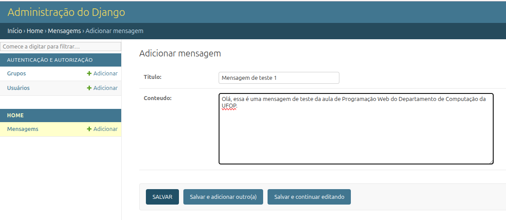

# Roteiro — Construindo um site com Django + Tailwind + Docker

Esta é a continuação do roteiro para você construir, do zero, o projeto
`demo-django`: um site simples de uma página, escrito em **Django**, estilizado
com **Tailwind CSS** (via CDN), salvando dados em **SQLite** e executado dentro
de um container **Docker**.

Nesta roteiro, você terá uma página inicial que lista mensagens cadastradas no banco
através do painel administrativo do Django.

---

## Sumário

1. [Executar e parar o projeto](#1-executar-e-parar-o-projeto)
2. [Criar o usuário admin e cadastrar mensagens](#2-criar-o-usuário-admin-e-cadastrar-mensagens)
3. [Adicionar um campo no model](#3-adicionar-um-campo-no-model)
4. [Criar um novo model com relacionamento](#4-criar-um-novo-model-com-relacionamento)
5. [Criar uma nova página](#5-criar-uma-nova-página)
6. [Mudar o visual da página](#6-mudar-o-visual-da-página)
7. [Filtrar mensagens](#7-filtrar-mensagens)

---

## 1. Executar e parar o projeto

Para **executar** o projeto:

```bash
docker compose up --build
```

Isso vai:

1. Construir a imagem (só na primeira vez, ou quando o `Dockerfile` mudar).
2. Aplicar as migrations no SQLite (`db.sqlite3` é criado).
3. Iniciar o servidor em `http://localhost:8000`.

Abra **http://localhost:8000** no navegador. Você deve ver a página com o
cabeçalho "Olá, Django + Tailwind!" e a seção dizendo "Nenhuma mensagem ainda."

Para contruir essa página, você deve executar o [roteiro anterior](roteiro-django-projeto-inicial.md).

Para **parar** o projeto:

`Ctrl+C` no terminal. Para remover o container:

```bash
docker compose down
```

---

## 2. Criar o usuário admin e cadastrar mensagens

Com o servidor rodando, **abra um segundo terminal** na mesma pasta e execute:

```bash
docker compose exec web python manage.py createsuperuser
```

Informe um nome de usuário, e-mail (opcional) e senha. Em seguida:

1. Acesse **http://localhost:8000/admin/**.
2. Faça login com o usuário criado.
3. Clique em **Mensagens → Adicionar**.
4. Preencha título e conteúdo e salve.
5. Volte a **http://localhost:8000/** — sua mensagem aparece na lista.

Executando esse passo e o roteiro anterior, você acabou de construir um site completo com modelo, view,
template, banco de dados e admin.

Agora, você pode acessar o painel de administração.

Acesse o menu Admin no DJango (menu superior), utilizando as credenciais de acesso que você cadastrou:

http://localhost:8000/admin/


## Cadastrando uma mensagem

Após realizar o login no painel administrativo, acesse: `Home --> Mensagens`

Em seguida, cadastre uma nova mensagem, conforme o exemplo abaixo:



Depois, retorne à página principal e observe que a nova mensagem cadastrada será exibida.

Por fim, abra o código correspondente no Django e tente compreender como ocorre o processo de cadastro e exibição da mensagem.

## 3. Adicionar um campo no model

Nesta seção, você vai adicionar um campo `autor` ao modelo `Mensagem`, atualizar
o banco de dados via *migrations* e exibir o novo campo na página inicial.

> **Importante:** sempre que você muda um `model`, o Django precisa que você
> gere e aplique uma *migration*. É ela que altera a estrutura do SQLite para
> refletir o novo campo.

### Passo 1 — Editar o model

Abra o arquivo `home/models.py` e adicione a linha do campo `autor`:

```python
from django.db import models


class Mensagem(models.Model):
    titulo = models.CharField(max_length=120)
    conteudo = models.TextField()
    autor = models.CharField(max_length=80, default="Anônimo")   # ← novo campo
    criada_em = models.DateTimeField(auto_now_add=True)

    class Meta:
        ordering = ["-criada_em"]

    def __str__(self):
        return self.titulo
```

> **Por que `default="Anônimo"`?** Como já existem mensagens no banco, o Django
> precisa saber o que preencher na coluna `autor` para as linhas antigas. Sem
> um `default`, ele vai te perguntar isso no terminal durante o `makemigrations`.

### Passo 2 — Gerar a migration

Em um terminal, na mesma pasta do `docker-compose.yml`, execute:

```bash
docker compose run --rm web python manage.py makemigrations
```

A saída esperada é parecida com:

```
Migrations for 'home':
  home/migrations/0002_mensagem_autor.py
    + Add field autor to mensagem
```

O Django criou um novo arquivo dentro de `home/migrations/` descrevendo a
alteração. **Não edite esse arquivo manualmente.**

### Passo 3 — Aplicar a migration no banco

```bash
docker compose run --rm web python manage.py migrate
```

A saída esperada termina com algo como:

```
Applying home.0002_mensagem_autor... OK
```

Pronto: a tabela `home_mensagem` no SQLite agora tem a coluna `autor`.

### Passo 4 — Exibir o novo campo no template

Abra `templates/home/index.html` e, dentro do ``,
acrescente a linha que mostra o autor:

```html
<li class="border-l-2 border-emerald-400 pl-4 py-1">
    <h3 class="font-semibold">{{ m.titulo }}</h3>
    <p class="text-sm text-slate-300">{{ m.conteudo }}</p>
    <span class="text-xs text-slate-400">por {{ m.autor }}</span>   {# ← novo #}
    <span class="text-xs text-slate-500">{{ m.criada_em|date:"d/m/Y H:i" }}</span>
</li>
```

### Passo 5 — Testar no navegador e no admin

1. Suba o servidor (se já não estiver rodando): `docker compose up`.
2. Acesse **http://localhost:8000/admin/** → **Mensagens → Adicionar**. Você
   verá o campo `Autor` no formulário.
3. Cadastre uma mensagem nova preenchendo o autor.
4. Abra **http://localhost:8000/** — a mensagem aparece com o autor logo
   abaixo do conteúdo.

> **Dica de depuração:** se o campo não aparecer no admin, confira se o passo 3
> (`migrate`) foi executado sem erros. Se a página quebrar com
> `OperationalError: no such column`, é sinal de que a migration ainda não
> foi aplicada.

## 5. Criar uma nova página

Nesta seção, você vai criar uma página `/sobre/` que exibe um conteúdo
estático. O fluxo é sempre o mesmo no Django: **rota → view → template**.

### Passo 1 — Criar a função (view) em `home/views.py`

Abra `home/views.py` e adicione a função `sobre` no final do arquivo:

```python
from django.shortcuts import render

from .models import Mensagem


def index(request):
    mensagens = Mensagem.objects.all()
    return render(request, "home/index.html", {"mensagens": mensagens})


def sobre(request):                                   # ← nova view
    return render(request, "home/sobre.html")
```

A view é a função Python que recebe a requisição (`request`) e devolve uma
resposta — aqui, ela apenas renderiza um template.

### Passo 2 — Registrar a rota em `home/urls.py`

Abra `home/urls.py` e adicione a nova rota:

```python
from django.urls import path

from . import views

urlpatterns = [
    path("", views.index, name="index"),
    path("sobre/", views.sobre, name="sobre"),       # ← nova rota
]
```

A partir de agora, toda requisição a `http://localhost:8000/sobre/` será
direcionada para a função `views.sobre`.

### Passo 3 — Criar o template `templates/home/sobre.html`

Crie o arquivo `templates/home/sobre.html` com o conteúdo abaixo:

```html
<!DOCTYPE html>
<html lang="pt-br">
<head>
    <meta charset="UTF-8">
    <meta name="viewport" content="width=device-width, initial-scale=1.0">
    <title>Sobre · Demo Django</title>
    <script src="https://cdn.tailwindcss.com"></script>
</head>
<body class="bg-gradient-to-br from-slate-900 via-indigo-900 to-slate-900 min-h-screen text-slate-100">

    <header class="container mx-auto px-6 py-12">
        <nav class="flex items-center justify-between">
            <a href="/" class="font-mono text-sm text-slate-300 hover:text-white">← voltar</a>
            <a href="/admin/" class="text-sm text-slate-300 hover:text-white">/admin</a>
        </nav>
    </header>

    <main class="container mx-auto px-6 py-12 max-w-3xl">
        <h1 class="text-5xl font-bold mb-6">Sobre este projeto</h1>
        <p class="text-lg text-slate-300 leading-relaxed">
            Este site é um exemplo da aula de Programação Web. Ele usa
            <strong>Django</strong> como framework backend, <strong>SQLite</strong>
            como banco de dados, <strong>Tailwind CSS</strong> via CDN para
            estilização e roda dentro de um container <strong>Docker</strong>.
        </p>
    </main>

</body>
</html>
```

### Passo 4 — Testar no navegador

Com o servidor rodando, acesse **http://localhost:8000/sobre/**. Você deve
ver a nova página "Sobre este projeto".

> **Não precisa reiniciar o container.** O Django detecta mudanças em
> `views.py`, `urls.py` e templates automaticamente. Se nada mudar, recarregue
> a página com `Ctrl+F5`.

### Passo 5 — Criar link para a nova página no menu

No `templates/home/index.html`, dentro do `<nav>` do `<header>`, adicione um
link para a página `/sobre/`:

```html
<a href="/sobre/" class="text-sm text-slate-300 hover:text-white transition">/sobre</a>
```

> **Dica:** em projetos reais, em vez de escrever `/sobre/` no `href`, use
> ``. Assim, se a rota mudar no `urls.py`, o link continua
> funcionando.

---

## 6. Mudar o visual da página

Edite as classes Tailwind em `templates/home/index.html`. Por exemplo, troque
o gradiente do `<body>`:

```html
<!-- antes -->
<body class="bg-gradient-to-br from-slate-900 via-indigo-900 to-slate-900 ...">

<!-- depois -->
<body class="bg-gradient-to-br from-emerald-900 via-teal-900 to-slate-900 ...">
```

Salve o arquivo e recarregue o navegador — o Tailwind via CDN aplica a mudança
imediatamente, sem precisar de build.


## Fluxo MTV (Model–Template–View)

Resumo do que acontece quando alguém acessa `http://localhost:8000/`:

```
Navegador
   ↓
core/urls.py        →  encaminha "/" para o app home
   ↓
home/urls.py        →  encaminha "" para a view index
   ↓
home/views.py       →  consulta o banco via models.py
   ↓
home/models.py      →  ORM converte para SQL no SQLite
   ↓
templates/home/index.html  →  renderiza o HTML com os dados
   ↓
HTML pronto         →  navegador exibe a página
```

Esse é o **padrão MTV** do Django (equivalente ao MVC clássico):

- **Model** = `home/models.py` (estrutura dos dados).
- **Template** = `templates/home/index.html` (apresentação).
- **View** = `home/views.py` (lógica que junta dados + template).

---

## Estrutura final do projeto

```
demo-django/
├── core/
│   ├── __init__.py
│   ├── asgi.py
│   ├── settings.py
│   ├── urls.py
│   └── wsgi.py
├── home/
│   ├── migrations/
│   │   ├── __init__.py
│   │   └── 0001_initial.py
│   ├── __init__.py
│   ├── admin.py
│   ├── apps.py
│   ├── models.py
│   ├── urls.py
│   └── views.py
├── templates/
│   └── home/
│       └── index.html
├── .dockerignore
├── .gitignore
├── docker-compose.yml
├── Dockerfile
├── manage.py
├── README.md
└── requirements.txt
```
